## License
MIT License © 2026 Rental System
---
# Rental System

**Rental System** е уеб-базирана система за управление на имоти под наем, разработена с PHP Laravel.
Проектът позволява публикуване на имоти, изпращане на заявки за наемане на свободен за наемане имот, както и пълно административно управление на наематели, договори, имоти и потребителски профили.
Проектът демонстрира работа с Laravel MVC архитектурата, Релационни бази данни, Authentication и роли, Реална бизнес интеграция
---

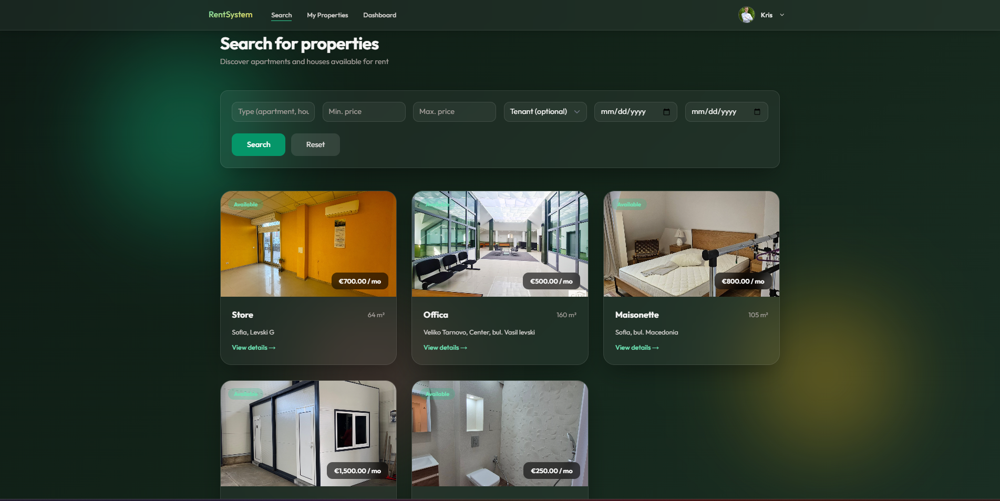

## Цел на проекта:

- автоматизира процеса по отдаване и наемане на имоти под наем 
- улеснява комуникацията между наемодатели и наематели
- предоставя централизирана административна система за управление
--- 
## Потребителски роли: 

### Гост (нерегистриран потребител)

- преглежда списъка с публикувани от други регистрирани потребители имоти
- отваря детайлната страница на имота като няма право да изпраща заявка за наемане към администраторския панел
- право на регистрация/вход в системата 

### Регистрирани потребители (User)

- има право на вход в потребителския си профил
- управлява собствения си профил с прилежащата информация
- управлява/създава собствени имоти и прилежащата информация под формата на основни характеристики на имотите като: тип на имота, адрес, квадратура на площта, месечна наемна цена в евро и снимков материал на прилежащите площи на имота
- може да изпраща заявки към административния панел за ненаети имоти като посочва датата на започване на наема и крайната дата за напускане на имота

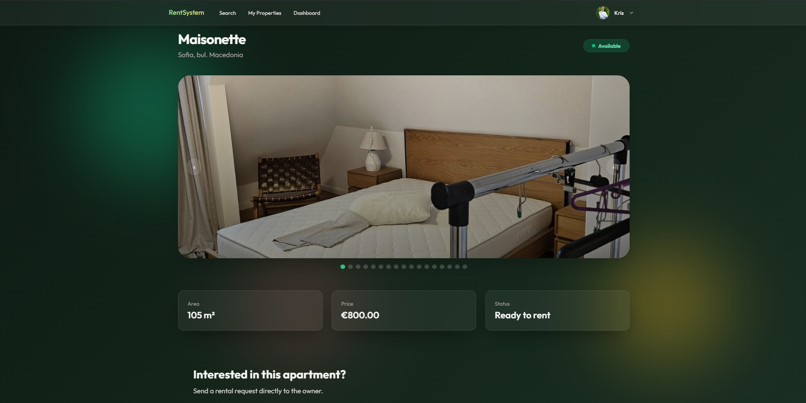

### Администратор (Admin)

- има право да достъпва административния панел от общото навигационно меню
- има право да управлява/изтрива/редактира всички имоти без значение от техния собственик
- има право да управлява наематели, както и тяхната информация по договора както и информация по профила като: потребителско име, имейл адрес, парола и добавяне/отнемане на администраторски права.
- изпълнява одобрителна/отказваща функция спрямо заявките от потребителите за наемане на имот
- създава и управлява договори за наеми на наети от потребители имоти
- притежава всички права на обикновения потребител

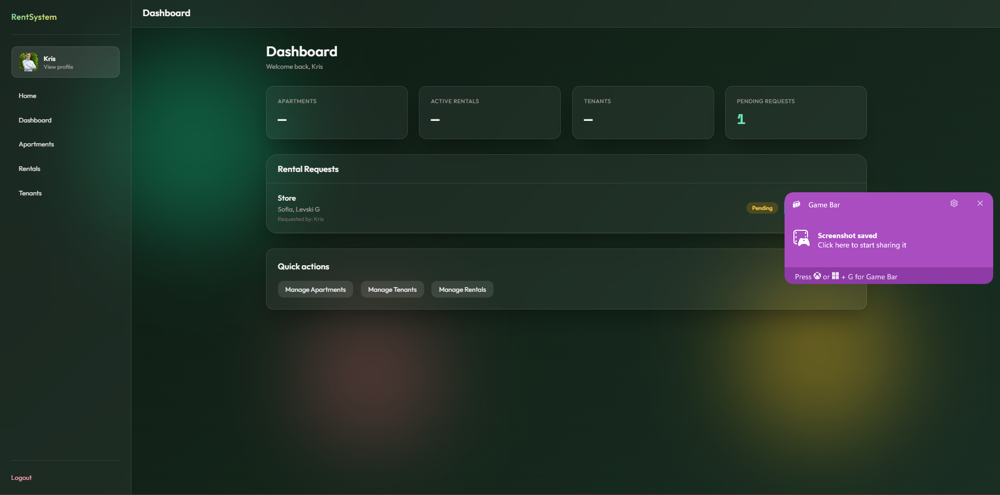

--- 

## Основни Функционалности

### Управление на имоти
- създаване, редакция, изтриване и преглед на имоти
- качване на снимков материал на апартаменти, както и индивидуално изтриване/добавяне на снимка посредством страницата за редакция на имот
- показване на адресна информация на имота, месечната наемна цена, статус относно заетостта на имота както и квадратурата на прилежащите площи
- публичен списък с всички имоти публикувани от различни потребители както и набор от филтриращи елементи спомагащи за по лесното отсяване на желани от потребителя имоти


### Заявки за наем на имот

- изпращане на заявка за желание за наем на ненает имот 
- преглед на наемните заявки от администратора в главното меню на администраторския панел
- одобряваща и отказваща опция от страна на администратора към желаещия наемател
- автоматично създаване на договор по наем на имот след одобрителна функция на администратора


### Договори за наем

- създаване на персонални договори между наемател и имот
- статуси на заявка за наемане : 'pending', 'active', 'rejected'
- възможност за прегледа и редакция на всички договори в администраторския панел

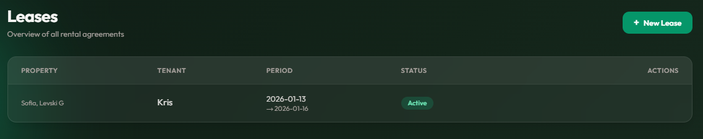

### Authentication и сигурност
- регистрация и вход на потребители
- защитен маршрут и хашване на потребителска парола
- достъп базиран изцяло на потребителската роля

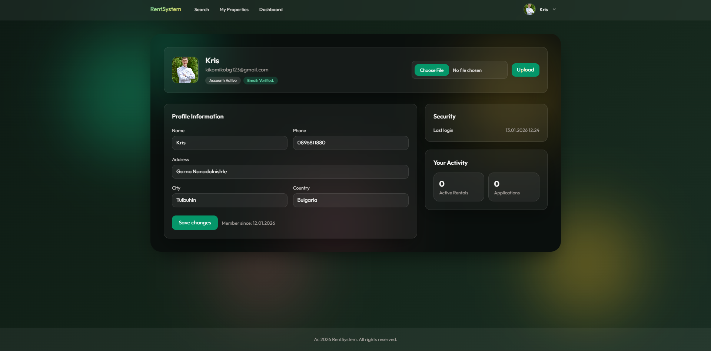

---
## Използвани технологии

### Backend
- PHP 8.2
- Laravel Framework
- MySQL
- Docker

### Frontend
- Blade Templates
- Tailwind CSS
- Vite
- Взет е стил от шаблон от TemplateMo ("https://templatemo.com/tm-607-glass-admin")

---

## Инсталация и стартиране

### 1. Клониране на проекта
- Използвана е VmmemWSL платформа Linux-Ubuntu за клониране на проект

```bash
git clone https://github.com/FMI-VT/sail-codespace-laravel.git
cd rent-system
```

### 2. Инсталиране на зависимости
```bash
composer install
npm install
npm run build
```

### 3. Конфигуриране на среда
```bash
cp .env.example .env
php artisan key:generate
```

- Добавяме попълвания за базата в .env файла
```env
DB_DATABASE=rental_system
DB_USERNAME=root
DB_PASSWORD=
```

### 4. Миграции
```bash
php artisan migrate
```

### 5. Стартиране на приложението
```bash
php artisan serve
npm run dev
```

### 6. Активация на сийдъри за информация
```bash
php artisan db:seed
```

### 7. Достъп до страницата на проекта
- Проектът се достъпва чрез:
http://127.0.0.1:8000


### Структура на проекта:
- app/Http/Controllers - Контролери
- app/Models - Модели
- resources/view - Blade шаблони
- routes/web.php - Уеб маршрути
- database/migrations - Миграции
- database/seeders - Сийдъри за примерна информация в базата
- public/storage - Качени файлове като снимки

---

## 1. Модели

- User - моделът представлява регистриран потребител в системата
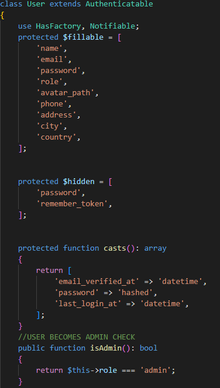
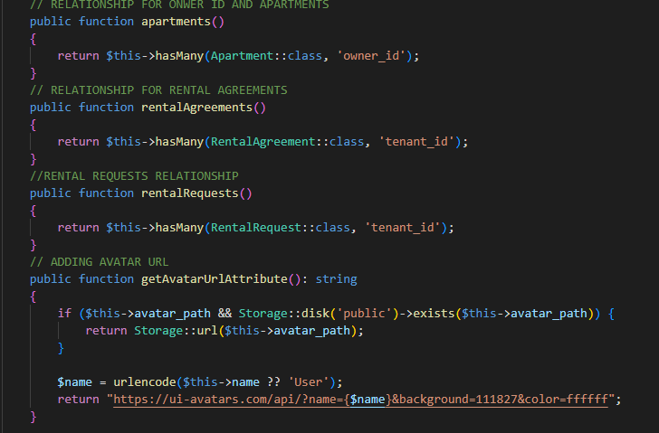

- използва се за Authentication
- може да има роля (user/admin)
- има релации с апартаменти и договори

# Релации:
- един потребител може да има много апартаменти
- един потребител може да бъде наемател по много договори

---

- Apartment - моделът описва имот, който може да бъде отдаван по наем
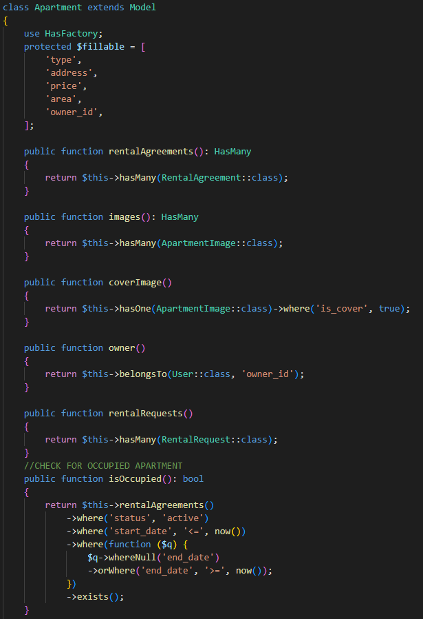

- съхранява адрес, цена, тип, площ и ID на собственика
- свързан е с потребителя (собственика)
- използва се в публичната и админ частта

# Релации:

- апартамента принадлежи само на един потребител
- апартамента може да има много заявки за наем

---

- RentalRequest - моделът представлява заявка за наем от потребител

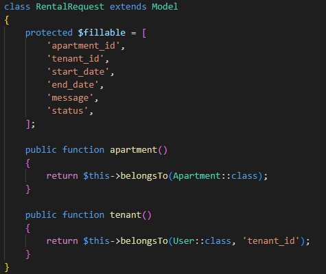

- съхранява информация за избран имот и кандидат-наемател
- използва се за одобрение или отказ от администратор

# Релации: 

- много заявки могат да принадлеждат на един апартамент
- много заявки могат да бъдат пуснати от един потребител

---

- RentalAgreement - модела описва договора за наем


- създава се след одобрена заявка от потребителя
- има статус (pending, active, rejected)
- свързва апартамент и наемател

---

## 2. Контролери

- ApartmentController - отговаря за публичната част на апартаментите

# Основни методи:

- index() - показва списък с всички налични апартаменти и спомага филтрацията им според потребителските изисквания
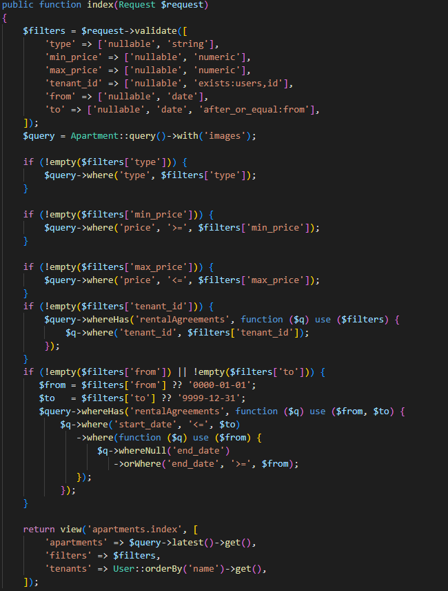

- store() - запазва нужната информация след създаването на нов имот

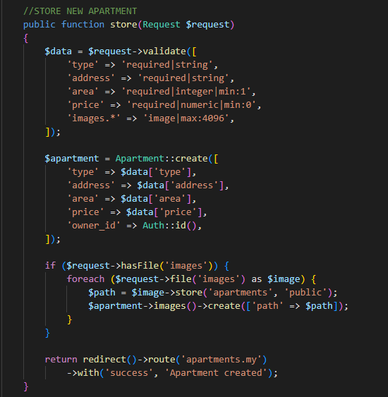

- deleteImage() - използва се за изтриване на индивидуална снимка при редакция на профил
- destroy() - изтрива всякаква информация за имот от базата и от системата

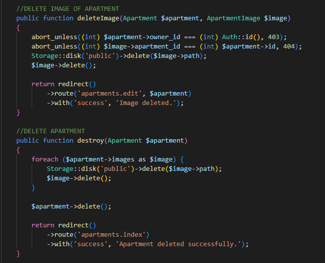

---

- RentalRequestController - управлява заявките за наем от страна на потребителя

# Основни методи

- store() - използва се за създаване на нова заявка за имот

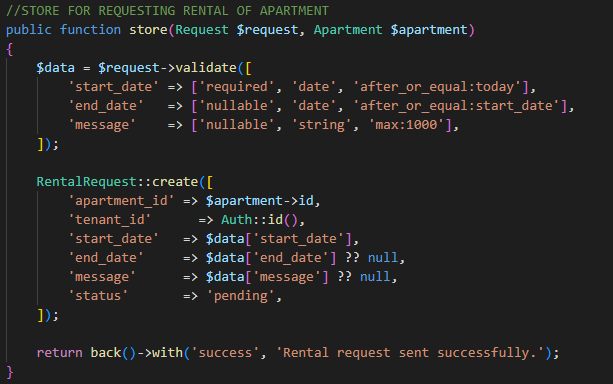

---

- Admin Controllers - административна логика 

- DashboardController - визуализира обобщена информация за системата
- AdminApartmentController - CRUD управление на апартаменти 
- TenantController - управление на наематели, преглед и редакция на потребителски данни
- RentalAgreementController - създаване и управление на договори, промяна на статус, визуализация на активни и приключени договори

---

## 3. Views

- resources/views/apartments - всички публични страници достъпни от User и Admin
- resources/views/admin - всички администраторски страници достъпни само от Admin
- resources/views/auth - регистрация и вход

# Views използват също:
- layout-и за повторна употреба
- компоненти
- условна логика за роли и достъп

---

## 4. Routes

# Основни групи:
- публични маршрути използвани за начална страница и апартаменти
- защитени маршрути за Authenticated потребители
- административни маршрути с Middleware достъп

# Routes осигуряват: 
- разделение на логиката
- сигурност заради Middleware
- структуриране на URL адреси

## 5. Схема на базата

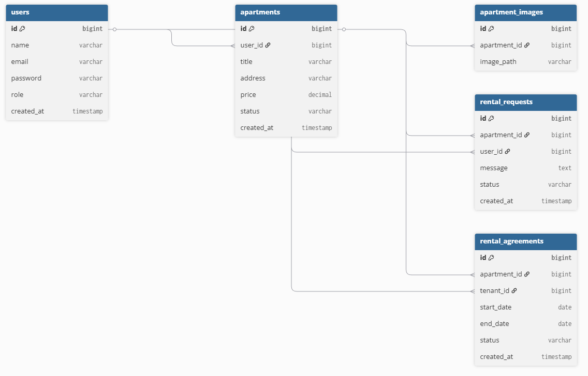

## Лиценз
- Проектът е лицензиран под MIT License (https://choosealicense.com/licenses/mit/)

